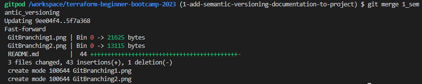
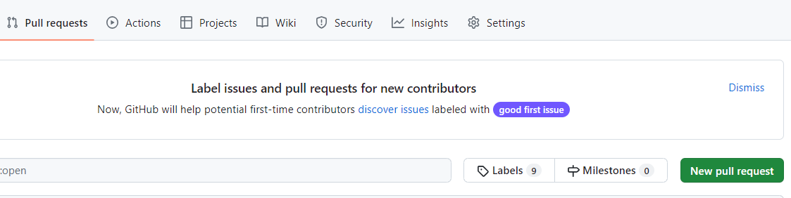
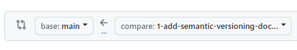
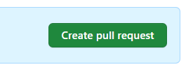
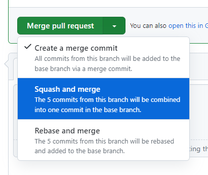
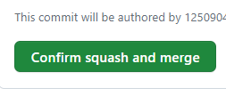
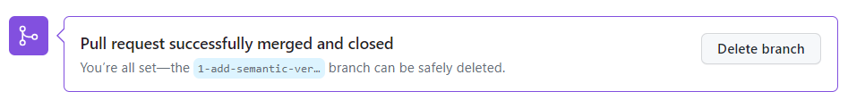
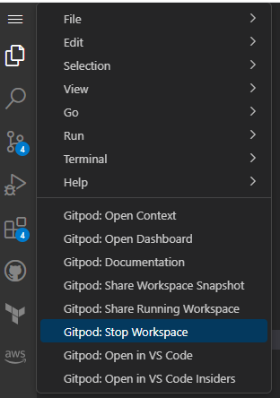

# Terraform Beginner Bootcamp 2023


## Helping Friends 09/14/23
I kinda like being the one among my friends, who have signed up for the bootcamp, to ask me for 
assistance.  What I'm finding is that they don't listen to me, and not following my directions.

Both are older gentlemen, and well versed in their own areas of IT. Having participated
in the previous bootcamp, getting set up was easy for me, for this bootcamp.  I watched the new 
videos and followed the directions. One friend wanted to use a local development enviromnent.
That's great.  But I won't be assisting him with getting it fixed or issues with his project
if it is cause of not matching the teaching environment.

I also wonder if b/c I am female and younger, that I'm being ignored.
*This is one reason why it's so hard for ladies in IT.* 

No, I don't know everything, **but you asked me for help**; listen to what I have to say/suggest.
Together we'll get this figured out.

https://github.com/adam-p/markdown-here/wiki/Markdown-Cheatsheet

```
Code Block - uses triple back ticks '```' 
```

```python
print("Hello, World!")
```

add a image  (this seems to only work, for me, when using github to edit the file, not from the gitpod env.)

```! [Delicate at night] (https://github.com/shanmorton-bootcamp/terraform-beginner-bootcamp-2023/assets/125090413/e10c3715-0083-42a5-aa57-249400aeb16a)
! [] ()
```


Using a '>' will quote a line of text as below:

>Can use an HTML img to size up or down the image 

## References
relative references:

 format:  [] ()

- https://www.portland.gov/sites/default/files/code/110-sd-zone_1.pdf

- [PDX houseing codes] (https://www.portland.gov/sites/default/files/code/110-sd-zone_1.pdf)

## Checkboxes

This is the markup to use checkboxes
```
- [x] step 1
- [ ] step 2
- [x]  step 3 :tada:
- [ ] step 4
```

- [x] step 1
- [ ] step 2
- [x]  step 3 :tada:
- [ ] step 4


## Tables and emoji's
https://gist.github.com/rxaviers/7360908

```
| Name | Icon | Image |
| --- | --- | --- |
| Smiley | `:smiley:` | :smiley: |
```
| Name | Icon | Image |
| --- | --- | --- |
| Smiley | `:smiley:` | :smiley: |


## Branching Tagging PR :smiling_imp:
Now going through the video for Branching and Tagging

I knew you could create, checkout, and move to a new branch in one command,
but I like to perform those tasks seprately, as I'm still new and unsure.

Now I am setting the upstream command to push to the branch; something that always has to be done each time you create a new branch.

Check this screenshot:


I was able to push to the branch and set the upstream branch (branch I'll push to)


Pulled from (semver.org) [https://semver.org/]

Given a version number MAJOR.MINOR.PATCH, increment the:

- MAJOR version when you make incompatible API changes
- MINOR version when you add functionality in a backward compatible manner
- PATCH version when you make backward compatible bug fixes
Additional labels for pre-release and build metadata are available as extensions to the MAJOR.MINOR.PATCH format.

To creat the tag for a branch the cmd is
git tag M.m.P   
Below is the tag I used for my branch   

```
git tag 0.1.0
```
Then push the tags to the branch:
```
git push --tags
```

See the results:


Following the video, we created a new branch from the issue. 

Then merged the 1_semantic_versioning branch with the newer, longer named branch with
this command:
```
git merge 1_semantic_versioning
```

This is the visual result:



Then pushed that up to the newest branch: 1-add-semantic-versioning-documentation-to-project
This merged the work I'd done in 1_semantic_versioning branch to this new one.

Tagged the newest branch with 
``` 
git tag 0.1.1
git push --tags
```

### Creating a pull request

Back in Github, from the main page of your repo there is a **pull requests** button:


Click on the new pull request button. Then you'll choose which branch you want to move into the main branch. Choose from the dropdown and look at the arrow; you'll be putting the feature branch work into the main branch 
 

Create the pull request:


Choose the merge option you want; we'll be using the squash and merge


confirm the S&M



and when successful you'll get this mesg and can remove the branch, if you want.

We'll **not** be removing old branches as they are required, to allow a look back for grading.

Andrew showed us how to close properly the gitpod env's.  I used to left my old one open but
did find that I ran out of time and had env's left over that needed to removed.

Now that I know how to close these properly...will be making sure that I push all
my code and close my gitpod env. 


